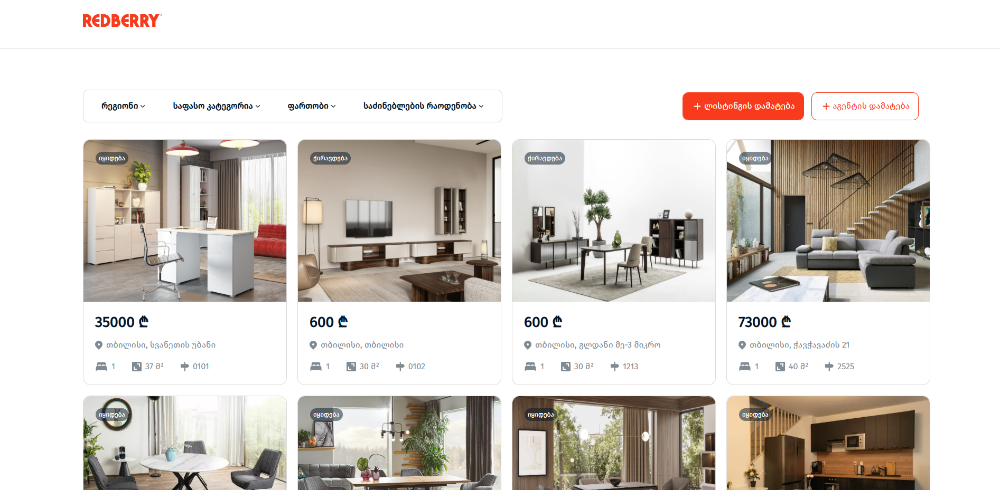
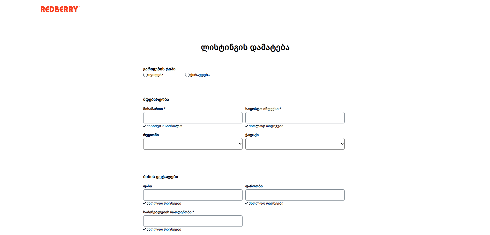
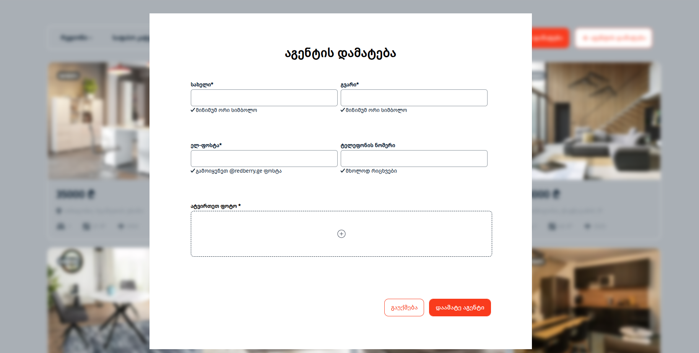

# 🌟 Real Estate Manager

This is my personal project built as part of the **Redberry Challenge**. The goal was to create a real estate management web application where users can **add new properties**, **assign agents**, and **manage listings**. It showcases my ability to build clean, reusable components and implement modern web development practices using React and TypeScript.

---

## 🚀 Features

- 🏠 Create, edit, and delete real estate listings
- 👤 Add and assign agents to properties
- 🔄 Dynamically update the UI without page refresh
- ♻️ Reusable components with a clean file structure
- 📄 Multi-page app with routing
- 💾 Persistent data using Local Storage

---

## 🛠️ Tech Stack

This project is built using the following technologies:

- **React** – for building reusable UI components
- **React Router** – for client-side routing
- **TypeScript** – for type safety and better development experience
- **useContext** – for managing global state
- **Styled Components** – for modular and scoped styling
- **Local Storage** – for storing data across sessions
- **Custom Hooks** – for encapsulating logic and improving code reuse

---

## 📸 Screenshots

### 🏠 All tasks (Homepage)

### 📜 Add listing

### 🏠 Property Page

### 👲 Agent modal

## 🧠 What I Learned

Through this project, I strengthened my knowledge in:

- 🔧 Component-based architecture in React
- 🌐 Managing global state using `useContext`
- 🧭 Implementing routing and navigation in multi-page apps
- ⚡ Updating the UI in real-time without page reloads
- 💾 Using Local Storage for persistent data
- 📡 Working with APIs for real estate and agent management

---

## 👤 Author

**Vladimer Gabisonia**
🔗 [GitHub](https://github.com/vakkko)
